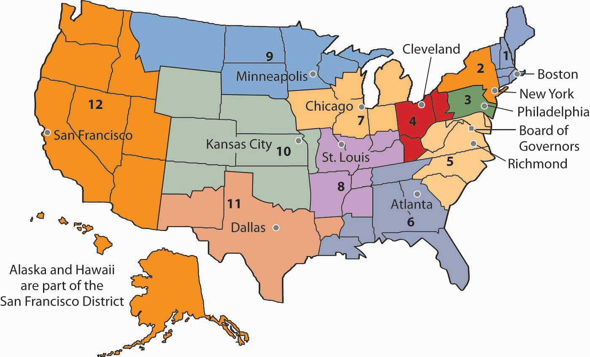
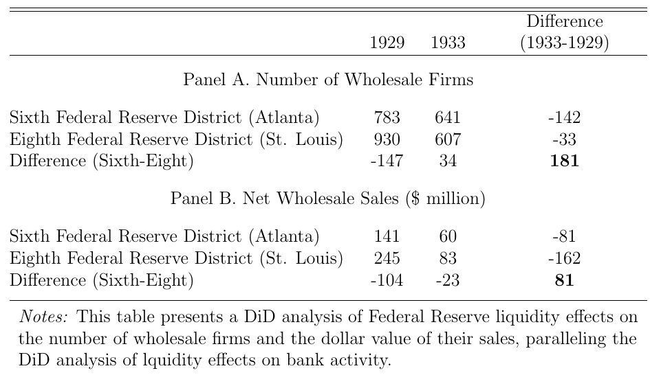
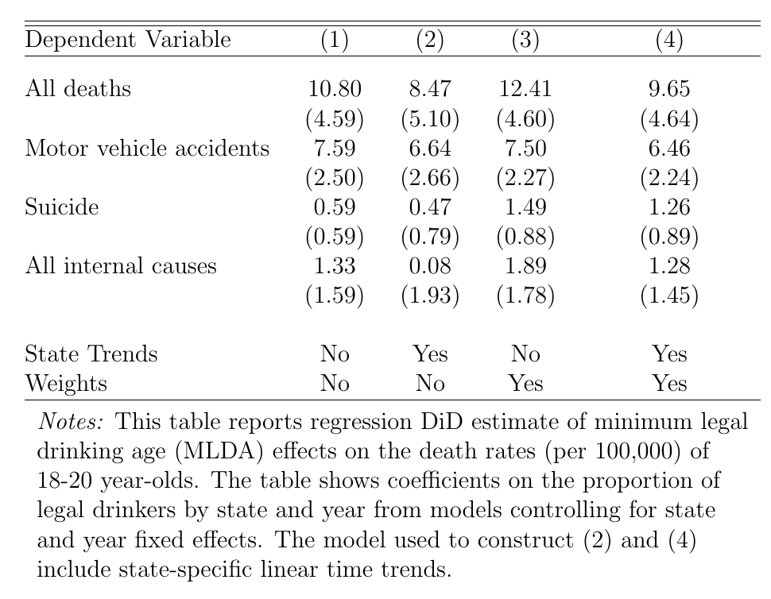
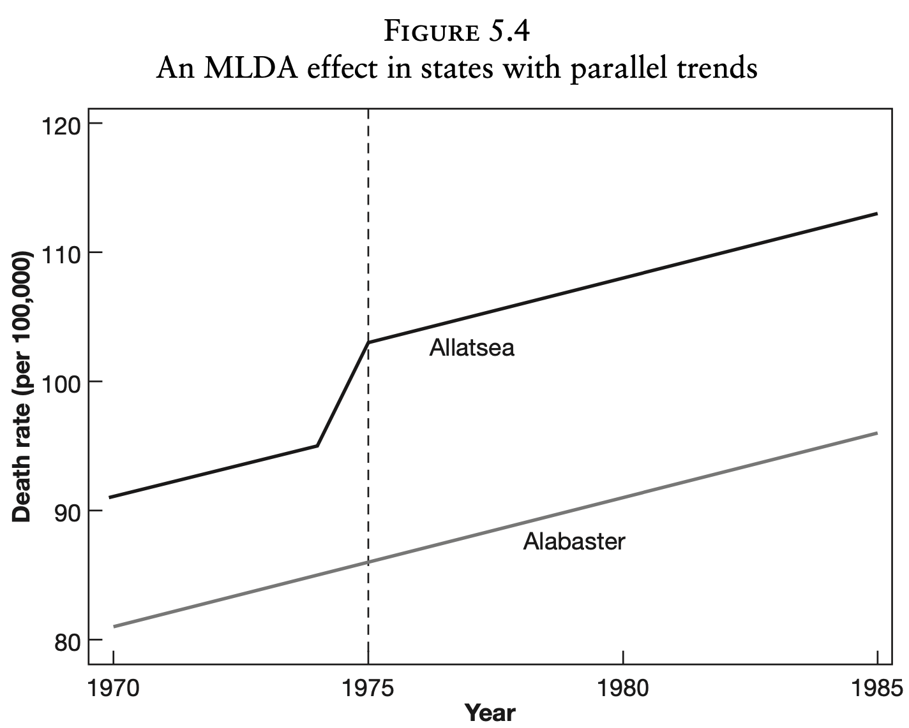
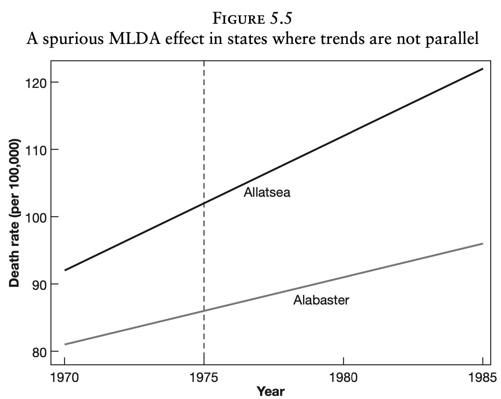
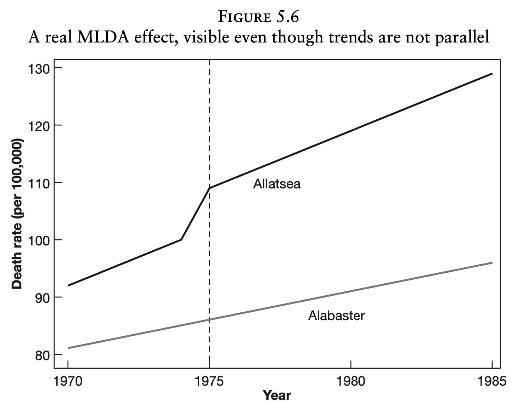

class: inverse, middle

```{r Setup, include = F}
options(htmltools.dir.version = FALSE)
knitr::opts_chunk$set(echo = TRUE, cache=TRUE)
#devtools::install_github("hadley/emo")

library(pacman)
p_load(
  ggthemes, viridis, knitr, AER, extrafont, tidyverse, magrittr, wooldridge, 
  stargazer, latex2exp, parallel, broom, kableExtra, ggforce, margins, furrr, 
  gapminder, emo, stringr, janitor
)

# Define colors
red_pink <- "#EC7662"
turquoise <- "#20B2AA"
orange <- "#FFA500"
red <- "#fb6107"
blue <- "#4682B4"
green <- "#8bb174"
grey_light <- "grey70"
grey_mid <- "grey50"
grey_dark <- "grey20"
purple <- "#6A5ACD"
met_slate <- "#23373b" # metropolis font color
slate = "#708090"
# Knitr options
opts_chunk$set(
  comment = "#>",
  fig.align = "center",
  fig.height = 7,
  fig.width = 10.5,
  #dpi = 300,
  #cache = T,
  warning = F,
  message = F
)  
theme_simple <- theme_bw() + theme(
  axis.line = element_line(color = met_slate),
  panel.grid = element_blank(),
  rect = element_blank(),
  strip.text = element_blank(),
  text = element_text(family = "Fira Sans", color = met_slate, size = 14),
  axis.text.x = element_text(size = 12),
  axis.text.y = element_text(size = 12),
  axis.ticks = element_blank(),
  plot.title = element_blank(),
  legend.position = "none"
)
theme_empty <- theme_bw() + theme(
  line = element_blank(),
  rect = element_blank(),
  strip.text = element_blank(),
  axis.text = element_blank(),
  plot.title = element_blank(),
  axis.title = element_blank(),
  plot.margin = structure(c(0, 0, -1, -1), unit = "lines", valid.unit = 3L, class = "unit"),
  legend.position = "none"
)
theme_axes <- theme_empty + theme(
  axis.title = element_text(size = 18),
  text = element_text(family = "Fira Sans", color = met_slate, size = 14),
  plot.margin = structure(c(0, 0, 0.1, 0), unit = "lines", valid.unit = 3L, class = "unit")
)
# Returns education data
wage2 <- get('wage2')
# MI school funding and test scores data
meap01 <- get('meap01') %>% 
  mutate(exppp = exppp/1000)
```

# Prologue

---
# Housekeeping

<br>

.hi-pink[Course evaluations] are open  
- If more than half of the class fills it out, I'll give 2 percentage points of extra credit  
- I value your feedback! (but please be respectful)  

--

.hi-pink[Last problem sets]

- Analytical problem set 7 due tomorrow (5/27)  
- Computational problem set 7 due Wednesday (6/1)  


---
# Cholera in the 1850's

.hi-pink[John Snow] used difference-in-differences in 1855 to prove that Cholera was being spread by contaminated water.  

--

```{r, echo = FALSE, out.width="80%", fig.align='center'}
knitr::include_graphics("jon-snow.jpeg")
```

(Not this Jon Snow)

---
# Cholera in the 1850's


.hi-pink[John Snow] used difference-in-differences in 1855 to prove that Cholera was being spread by contaminated water.  


### Beliefs at the time 

It was assumed at the time that Cholera was spread through things like...  

- Rotting material and bad smells  
- Low elevation  
- Bad breeding  
- Poverty  

Great examples of .hi-pink[bad econometrics]    

--

**What might be an "ideal" experiment to test Snow's hypothesis?**

---
# Cholera in the 1850's

### A change in water sources  

Many companies served London's water needs. One of them, the Lambeth Company, changed the location of their water source  

- **1849**: Thames River *downstream* from London `r emo::ji("poop")` 
- **1854**: Thames River *upstream* from London  

--

Our "treatment" is people having their water pumped from a .hi-blue[clean source]. Lambeth switching their water supply is a natural experiment  

1. Calculate change in Cholera rates **before** and **after** the switch for people served by Lambeth  
2. Calcuate the change in Cholera rates for some control group over the same time period  
3. Take the difference between (1) and (2) .smallest[(*Hence the name, DiD*)]


---
# Cholera in the 1850's


```{r cholera, echo = FALSE}
cholera_did_df = 
  tibble(
    Supplier = c("Non-Lambeth Only (Dirty)", "Lambeth + Others (Mix clean + dirty)"),
    `Death Rate 1849` = c(134.9, 130.1),
    `Death Rate 1854` = c(146.6, 84.9)
  )

kable(cholera_did_df)


```

Change for .hi-blue[Lambeth]: $y_{L,1854} - y_{L,1849} = 84.9 - 130.1 = -45.2$

**Q:** Is this all the evidence we need to conclude Cholera comes from water?  

--

**A:** No, it could reflect anything that changed between 1849 and 1854! 

--

Change .hi-orange[elsewhere]: $y_{NL,1854} - y_{NL,1849} = 146.6 - 134.9 = 11.7$


Cholera rates were actually **increasing** in places not served by Lambeth over the same time period!  

--

Estimated treatment effect is $\Delta \bar{y}_L - \Delta \bar{y}_{NL}  = -45.2 - 11.7 = -56.9$


---
# Cholera in the 1850's


Change .hi-orange[elsewhere]: $y_{NL,1854} - y_{NL,1849} = 146.6 - 134.9 = 11.7$  

 - This is our estimate for the **counterfactual**    
 - "Ideally" we'd know Cholera rates in 1854 for places served by .hi-blue[Lambeth] if they hadn't switched to clean water  
 - But we only observe data from what actually happened  

--

Thus, the change .hi-orange[elsewhere] is our approximation of what *would have happened* in areas served by .hi-blue[Lambeth] if they did not switch. 

--


What are we assuming? 

--

The **Parallel Trends Assumption**.

>That the difference between .hi-blue[Lambeth] and .hi-orange[non-Lambeth] areas would have remained the same if .hi-blue[Lambeth] hadn't switched their water source. 


---
# Cholera in the 1850's


### Actual outcomes  

```{r cholera_plot, echo = FALSE}

cholera_did_df |>
  pivot_longer(cols = 2:3) |>
  mutate(year = str_remove(name, "Death Rate ") |> as.numeric()) |>
  ggplot(aes(x = year, y = value, color = Supplier)) + 
  scale_color_manual(
    name = "",
    values = c(red_pink, blue),
    labels = c("Lambeth + Others", "Non-Lambeth")
  )+
  geom_line(size = 1.5) +
  labs(
    x = "Year",
    y = "Death Rate"
  ) +
  ylim(0, 150)+
  theme_minimal(base_size = 18)
```

---
# Cholera in the 1850's


### With our counterfactual  

```{r cholera_plot2, echo  = FALSE}

cholera_did_df |>
  pivot_longer(cols = 2:3) |>
  mutate(year = str_remove(name, "Death Rate ") |> as.numeric()) |>
  ggplot(aes(x = year, y = value, color = Supplier)) + 
  scale_color_manual(
    name = "",
    values = c(red_pink, blue),
    labels = c("Lambeth + Others", "Non-Lambeth")
  )+
  geom_line(size = 1.5) +
  geom_line(data= tibble(
     Supplier = rep("Counterfactual",2),
     name = c(NA,NA),  
     value = c(130.1, 130.1 + 11.7),
     year = c(1849, 1854)
   ), aes(x = year, y = value), linetype = "dashed", color = red_pink, size = 1.5) +
  labs(
    x = "Year",
    y = "Death Rate"
  ) +
  ylim(0, 150)+
  theme_minimal(base_size = 18)
```


---
class: inverse, middle

# Difference in Differences (DiD)

---

# Non-Random Treatment

<br>

We've talked about binary categorical variables. An important application of .hi-pink[dummy variables] is to study the impact of a treatment. 

--

The estimation of treatment effects is important in a wide range of fields. 
.hi-blue[Examples:] 
* impact of cash transfers on child health
* effect of class size on student achievement

--

In clinical trials of health interventions, a common question is whether use of a medicine will improve health outcomes.  

---

# Non-Random Treatment

Ideally treatment effects are evaluated using .hi-pink[randomized controlled trials].

--

We capture treatment with a dummy variable and use a simple statistical model  

$$Y_i = \beta_0 + \beta_1 D_i + u_i$$

--

for $i = 1, \dots, n,$ where $D_i = 1$ if treated and $D_i = 0$ if not treated, and
where $y_i$ is the outcome for individual $i$.  

--

**Q:** What are the interpretations of the coefficients $\beta_0$ and $\beta_1$?  

--

**Random assignment**: If $D_i$ and $u_i$ are .hi-pink[uncorrelated (A3.)], then OLS estimates will be unbiased.  

Our effect is the difference in mean outcomes for treated and untreated groups,
$\hat\beta_1 = \bar y_1 - \bar y_0$, called the **differences estimator**

---

# Non-Random Treatment

Often we are analyzing some _treatment_ that takes place at a particular time, and we have data .hi-pink[before and after] the treatment took place.  

--

If the policy intervention affected everyone and we have data both in pre- and post-policy periods, might consider using the **differences estimator**

> __Problem:__ Assumes that there are not other reasons for the change in mean outcomes before and after the treatment

--

In this case the dummy variable $D_i$ in effect stands for the impact of .hi-pink[all factors], including the treatment, that are different between the pre- and post- periods.

---

# Non-Random Treatment

Since .hi-pink[other factors] may be partially responsible for the change in mean outcomes, the difference estimator will likely be biased (example of exogeneity failing) 

--

This point emphasizes importance of a control group that does not receive the treatment. Sometimes policies have actual randomization, .hi-blue[(randomized field experiments)].

--

> __Example:__ Oregon Health Plan (OHP) experiment of 2008. 
Oregon decided to expand coverage of its version of Medicaid to groups not previously eligible, but this expanded coverage was rationed by a lottery to reduce the cost of the program: somewhat under half of those who registered were randomly selected and invited to apply for expanded coverage. 

--

Since treatment was randomly assigned, $E[u_i|D_i]=0$  


---

# DiD Concept

Most of the time, we are not so lucky to have real randomization. Instead we often have to use .hi-pink[natural experiments].

--

> __Setting:__ There is a discrete change in policy that affects only part of the population, and that there are both pre- and post-treatment observations for both those who received treatment and those who did not.

--

Since the policy change is not distributed randomly, mean outcomes for the treated and control group may differ for a variety of reasons.  

--

The .hi-pink[difference-in-difference (DiD)] method allows for differences between the treatment and control groups by measuring the treatment effect based on the **change** in outcomes before and after treatment for the treatment group **relative** to the control group.   

---


# DiD Structure

<br>

Suppose we have data on specific individuals $i = 1,\dots, n$ in each of two time periods $t = 1, 2$. A simple statistical formulation of the model is then:

--

$$Y_{it} = \beta_0 + \beta_1 T_t + \beta_2 D_i + \beta_3 (T_t \times D_i) + u_{it}$$
for $i = 1,\dots,n,$ and $t = 1, 2$. (Note that we have $2n$ data points). 

--

Here $T_t = 1$ if $t = 2$ and $T_t = 0$ if $t = 1$, while $D_i = 1$ if individual $i$ receives treatment and $D_i = 0$ if individual $i$ does not receive treatment. 


---

# DiD Structure

In the .hi-pink[pre-treatment period], $t = 1\implies T_t=0$, we have

$$E(y_{i1} | D_i = 0) = \beta_0 \qquad \text{and} \qquad E(y_{i1} | D_i = 1) = \beta_0 + \beta_2$$

--

We are allowing for the possibility that there was imperfect control, in the sense that treated and untreated may have different pre-treatment means.  

--

In the .hi-pink[post-treatment period], $t = 2\implies T_t=1$, we have

$$E(y_{i2} | D_i = 0) = \beta_0 + \beta_1 \quad \text{and} \quad E(y_{i2} | D_i = 1) = \beta_0 + \beta_1 + \beta_2 + \beta_3$$

--

The .hi-pink[treatment effect] corresponds to $\beta_3$: This is because
$$
\begin{aligned}
\text{Diff Treated:} & \ E(y_{i2} | D_i = 1) - E(y_{i1} | D_i = 1) = \beta_1 + \beta_3 \ \  \text{and}\\
\text{Diff Control:} & \ E(y_{i2} | D_i = 0) - E(y_{i1} | D_i = 0) = \beta_1
\end{aligned}
$$

---

# DiD Example

_"Monetary Intervention in the Great Depression"_ by **Gary Richardson and William Troost (JPE, 2009)**.

--

Consider the 1930s bank failures. Central Bank can prevent bank runs and bank failures by acting as lender of last resort to insolvent banks.

--

The twelve different regional Federal Reserve Districts reacted in the 1930s to potential bank failures in different ways.

--

* .hi-slate[Atlanta FRB (sixth district)] and .hi-purple[St Louis FRB (eighth district)] followed radically different policies on bank runs 

* Makes for a natural experiment, comparing outcomes for bank failures in Mississippi banks in the two districts

---

# DiD Example


### Banking simplified...  

- Banks take deposits from savers and then lend that money out to others  
- They do not hold enough cash on hand to give everyone their savings back if everyone tried to withdraw at once  
- Bank runs happen when people are afraid the bank is going to fail  
  - Worry about bank failure => Some people widthdraw their money  
  - More withdraws => more likely for the bank to fail  
  - More likely for bank to fail => More people withdraw  

--

### Differential policies by fed district  

The .hi-slate[Sixth District] made credit to banks widely available to ensure they had cash to cover withdraws, while .hi-purple[Eighth District] restricted lending to banks with the idea that it would "weed out" bad banks  

---
# DiD Example 

```{r, echo = FALSE, out.width="80%", out.align = "center"}

```

Mississippi is cut in half, the .hi-purple[northern part is St. Louis district] and the .hi-slate[southern part is Atlanta district].  

--

**We can use this as a natural experiment!**


---
# DiD Example  

R&T analyze this using .hi-pink[Difference-in-differences].

```{r, echo=FALSE}
p_load(kableExtra)

df_bank = tibble(Variable = c("No. of Banks open 1930", 
                    "No. of Banks open 1931", 
                    "Changes in banks open"),
       dist_8 = c(165, 132, -33),
       dist_6 = c(135, 121, -14),
       diff   = c(-30, -11,  19)) %>%
  kbl(caption = "Bank Losses by Policy",
      col.names = c("Variable",
                    "8th District",
                    "6th District",
                    "Diff., 6th-8th"))
#%>%  kable_classic(full_width = F, html_font = "Cambria")

df_bank

```

Estimated to have saved **19** banks, 14% of .hi-slate[Sixth District] in 1930.

--

.smallest[
*Note*: It is equivalent to think of the DiD estimator as  
- The difference in the change in the treated and the change in the untreated 
- The change in the difference between treated and untreated pre/post treatment  
]  

---

# DiD Required Assumption

A central issue is the .hi-pink[validity] of the control group, which is determined by the  .hi-pink[parallel trends] assumption: 

> In the absence of the _"treatment"_, would the number of open banks in the two
districts have been expected to evolve in the same way?  

```{r, echo=FALSE}
p_load(lubridate)
devtools::install_github("jrnold/masteringmetrics", subdir = "masteringmetrics")

data("banks", package="masteringmetrics")

# Only use yearly data in the DiD. Use # of banks on July 1st of each year. 
banks <- banks %>% 
  filter( month(date) == 7L, mday(date) == 1L) %>%
  mutate(year = year(date)) %>%
  select(year, matches("bi[ob][68]"))

# Generate the counterfactual using the difference between the number of banks in district 8 and district 6.
banks <- banks %>% 
  arrange(year) %>%
  mutate(diff86 = bib8[year == 1930] - bib6[year == 1930],
          counterfactual = if_else( year >= 1930, bib8 - diff86, NA_integer_)) %>% 
  select(-diff86)

```

```{r, plot-banks, echo=FALSE, out.width="60%", fig.align='center'}

banks_plot_df = banks |>
  select(year, bib8, bib6, counterfactual) %>%
  gather(variable, value, -year, na.rm=TRUE) %>% 
  mutate(
    variable = variable |> recode(
      bib8 = "8th district",
      bib6 = "6th district", 
      counterfactual = "6th Counterfactual")
  )

banks_plot_df |>  
  filter(variable != "6th Counterfactual") |>
  ggplot(aes(x=year, y=value, color=variable))+
  geom_point(size = 3)+
  geom_line(size=2)+
  scale_color_manual(values = c(slate, purple)) +
  ylab("Number of Banks in Business")+
  xlab("")+
  theme_minimal(base_size = 22)+
  theme(
    legend.title = element_blank(),
    legend.position = "bottom",
  )

```

---

# DiD Interpretation

### Now with a DiD Regression  

$$
\begin{aligned}
Y_{dt} = \beta_0 + \beta_1 T_t + \beta_2 D_d  + \beta_3 (T_t \times D_d) + u_{dt}
\end{aligned}
$$

One can use this data to get an estimate of the treatment effect $\hat\beta_3$ and a standard error $SE(\hat\beta_3)$ based on these twelve data points:

$$
\begin{aligned}
Y_{dt} = 167 - 49 T_t - 29 D_d  + 20.5(T_t \times D_d) + u_{dt}
\end{aligned}
$$

Here $T_t$ is coded 1 for 1931 or later, and $D_d=1$ for the 6th District. 

--

$\hat{\beta}_3$ has $t = 1.9$ which is significant at 10% level using a two-tailed test. 

This is about the best we can do with twelve data points.  

---

# DiD Interpretation

```{r, plot-banks-c, echo=FALSE, out.width="90%"}
banks_plot_df |>
  filter(variable != "6th Counterfactual") |>
  ggplot(aes(x=year, y=value, color=variable))+
  geom_point(size = 3)+
  geom_line(size=2)+
  geom_line(
    data = banks_plot_df |> filter(variable == "6th Counterfactual"),
    aes(x = year, y = value),
    color = slate, linetype = "dashed", size = 2
  )+
  scale_color_manual(values = c(slate, purple)) +
  ylab("Number of Banks in Business")+
  xlab("")+
  theme_minimal(base_size = 22)+
  theme(
    legend.title = element_blank(),
    legend.position = "bottom"
  )

```

The dashed line represents our assumed **counterfactual**. 


---

# DiD Interpretation

Let's do the same .hi-pink[DiD] with other outcome variables!

```{r, echo=FALSE, out.width="90%"}

```

--

Seems like more liberal credit availability saved a lot of wholesale firms.  


---
class: inverse, middle

# Panel Data  

```{R, load_data, include = F, cache = T}
panel_df <- read_csv("ukcpr.csv") %>%
  clean_names() %>%
  group_by(state_name, year) %>%
  transmute(
    min_wage = max(federal_minimum_wage, state_minimum_wage),
    poverty_rate = poverty_rate
  ) %>%
  ungroup() %>%
  rename(state = state_name)
```


---
# Types of data 

- **Cross sectional**: Observe some set of entity at one particular time  
- **Time Series**: Observe a single entity over multiple time periods  
- **Pooled Cross sectional**: Have a sample of entities over multiple time periods, but don't necessarily observe the same entities each period  

--

.pull-left[
.hi-yellow[Cross-sectional data:] individual $i$
```{R, cross_sectional_plot, echo = F}
panel_df %>% filter(year == 2017) %>%
  ggplot(data = ., aes(x = min_wage, y = poverty_rate)) +
  geom_point(size = 6, alpha = 0.9, color = orange) +
  xlab("Min. wage") +
  ylab("Poverty rate") +
  theme_pander(base_size = 40)
```
]

.pull-right[
.hi-purple[Time-series data:] time $t$
```{R, time_series_plot, echo = F}
panel_df %>% filter(state == "OR") %>%
  ggplot(data = ., aes(x = year, y = poverty_rate)) +
  geom_line(size = 0.8, color = purple, alpha = 0.9) +
  geom_point(size = 6, alpha = 1, color = purple) +
  xlab("Year") +
  ylab("Poverty rate") +
  theme_pander(base_size = 40)
```
]

--

.hi-pink[*Panel data*] combine these data types/dimensions: individual $i$ **at** time $t$.
---
layout: false
class: clear-slide

.hi-pink[*Panel data*] combine these data types/dimensions: individual $i$ **at** time $t$.

```{R, panel_plot, echo = F}
panel_df %>% filter(state %in% c("CA", "OR", "WA")) %>%
  ggplot(data = ., aes(x = year, y = poverty_rate, color = state)) +
  geom_point(size = 3.5, alpha = 0.4) +
  geom_line(size = 0.5) +
  xlab("Year") +
  ylab("Poverty rate") +
  scale_color_viridis_d("State", option = "C", end = 0.9) +
  theme_pander(base_size = 18) +
  theme(legend.position = "bottom")
```

---
name: definition

# Definition

.pull-left[

With .hi-pink[*panel data*], we have

- .hi-purple[repeated observations] $(t)$
- on .hi-yellow[multiple individuals] $(i)$.
]

--

.pull-right[
```{R, panel_data, echo = F}
panel_df %>%
  filter(state %in% c("CA", "OR", "WA")) %>%
  filter(year %in% c(1990, 2000, 2010)) %>%
  select(state, year, poverty_rate, min_wage) %>%
  arrange(state, year) %>%
  data.frame()
```
]

--

Thus, our regression equation with a panel dataset looks like
$$
\begin{align}
  y_{\color{#FFA500}{i}\color{#6A5ACD}{t}} = \beta_0 + \beta_1 x_{\color{#FFA500}{i}\color{#6A5ACD}{t}} + u_{\color{#FFA500}{i}\color{#6A5ACD}{t}}
\end{align}
$$
for .yellow[individual] $\color{#FFA500}{i}$ in .purple[time] $\color{#6A5ACD}{t}$.


---
# Controlling for unobserved factors  

We can use panel data to control for any unobserved factors that are constant within a larger group, **a solution to Omitted Variable Bias**.  

.hi-orange[How?]  

--

Easy! Just add a dummy variable for the group, and you've controlled for everything that is constant within that group. These are called .hi-orange[fixed effects].  

--

### For example  
- We can control for an individual's background, which is not changing over time, by adding an individual fixed effect  
- We can control for national economic conditions, which affect all individuals equally in a particular time period, by adding a time fixed effect   

---
# Fixed effects model  

Suppose we have a model 

$$y_{it} = \beta_0 + \beta_1 x_{it} + \sum_k \gamma_k Z_i^k + u_{it}$$

where $Z_i^1,Z_i^2,...,Z_i^K$ are $K$ variables that affect $y$, but are constant within individual $i$. 

--

Then we can substitute $\alpha_i = \sum_k \gamma_k Z_i^k$

$$y_{it} = \beta_0 + \beta_1 x_{it} + \alpha_i + u_{it}$$

where $\alpha_i$ represents the unobserved effect of all of the $Z^k$ variables on $y$ for individual $i$. 

---
# Fixed effects model

Practically, we can run this regression with a dummy variable for each individual (minus one)

$$y_{it} = \beta_0 + \beta_1 x_{it} + \sum_{i=2}^n\alpha_iA_i + u_{it}$$

where $A_i$ is a dummy variable equal to 1 if the observation comes from individual $i$.

--

**What are the fixed effects doing?**  
They subtract the mean outcome for each individual $y_{it}-\bar{y}_i$. Thus, we are looking at .hi-orange[within] variation, not .hi-blue[between] variation  

--

.hi-blue["Between"] is any variation in our data that can be explained by individuals  
.hi-orange["Within"] is any variation for an individual from one time period to another  

---
# We have seen this before...   

.center[]


---

class: inverse, middle

# DiD Example, Minimum Legal Drinking Age Laws

---
# MLDA Laws

This DiD estimates MLDA-induced deaths among 18-20 year olds, from 1970-1983.

--

**1933:** End of the federal alcohol Prohibition. Most states regulated the .hi-pink[Minimum Legal Drinking Age] to 21. However, some states including Kansas, New York and North Carolina maintained a drinking age of 18. 

--

**1971:** Voting ages were reduced to 18, and many states coincided this policy change of MLDA to 18. Arkansas, California, and Pennsylvania are among states that kept MLDA at 21. 

--

**1984:** National Minimum Drinking Age Act punished states set to 18 by withholding federal highway construction aid. 

--

.hi-blue[What happened between 1970 and 1984 when drinking age was reduced?]


---
# MLDA DiD model

### Alabama and Arkansas  
Alabama reduced MLDA to 19 in 1975, while Arkansas did not change theirs, let $D_s$ indicate whether the state is Alabama and $T_t$ is indicate whether it is after 1975.  

.hi-blue[Dependent variable:] death rates of 18-20 year olds in state $s$ and year $t$.

--

$$Y_{st} = \beta_0 + \beta_1 \text{D}_s + \beta_2 \text{T}_t + \beta_3 (D_s \times T_t) + u_{st},$$
--

.hi-pink[Treatment Effect:] $\beta_3$ measures the *causal* effect of lowering the drinking age on death rates of 18-20 year olds.  
 
--

.hi-pink[Key Assumption:] Alabama and Arkansas would have shared parallel trends in their death rates of 18-20 year olds throughout the period of analysis if Alabama had not changed their drinking age.   

---
# MLDA DiD model

### We can do better!  
What about the other states? Would we not want to use more observations?
Yes! But..

--

* States did not all lower to 18 at the same time, meaning there is no common post-treatment  period.

* Unobservable differences exist across states, constant across time. 

* Absense of a common treatment variable in a multi-state setting, since states chose ages of 18,19 and 20. 

--

To solve for these issues, use .hi-blue[state and year fixed effects] and replace $T_t \times D_d$ with a .hi-blue[common treatment variable], $LEGAL_{st}$, which measures the proportion of 18-20 year-olds allowed to drink in state $s$ and year $t$. 

---

# MLDA DiD model

<br>

.hi-blue[State-Year Panel Data:] Including District of Col. we have 51 "states" and 14 years, giving us 714 observations. 

--

The .hi-blue[multistate regression] DiD model looks like:

$$Y_{st} = \alpha_0 + \alpha_1 LEGAL_{st} + \sum_{k=\text{Alaska}}^{\text{Wyoming}} \alpha_k \text{State}_{ks} +\sum_{j=\text{1971}}^{\text{1983}} \alpha_j \text{Year}_{jt} + \nu_{st},$$

where now we are using state and year dummies to capture fixed effects, which uses Alabama as our reference state and 1970 as our reference year.

--

Regression results suggest that there was a significant increase in deaths, largely attributed to motor vehicle accidents.

---

# MLDA Results

```{r, echo=FALSE, out.width="90%"}

```

---

# MLDA Assumptions

Since we have many states and many years of observations, we can relax the .hi-pink[common trends] assumption. 

We are worried about differential trends in state death rates that would lead us to falsely attribute that pre-existing trend to our treatment.  

--

We can add .hi-blue[state trends] to control for this factor:  

$$
\begin{aligned}
Y_{st} =& \alpha_0 + \alpha_1 LEGAL_{st} + \sum_{k=\text{Alaska}}^{\text{Wyoming}} \alpha_k \text{State}_{ks} +\sum_{j=\text{1971}}^{\text{1983}} \alpha_j \text{Year}_{jt}\\
& \sum_{k=\text{Alaska}}^{\text{Wyoming}} \theta_k (\text{State}_{ks} \times t)+ \varepsilon_{st},
\end{aligned}
$$

Our treatment effect now comes from sharp deviations from an otherwise smooth trend.  

--
.hi-blue[What does this allow us to address?]

---

```{r, echo=FALSE, eval=FALSE}
# For those interested in generating these results, I've left in some code that won't appear in the slides. This is originally prepared by Jeffrey B. Arnold

# LINK: https://jrnold.github.io/masteringmetrics/mlda-difference-in-difference.html

p_load(haven, rlang, broom, clubSandwich)
data("deaths", package = "masteringmetrics")

deaths <- mutate(deaths, year_fct = factor(year))

# Regression DD Estimates of MLDA-Induced Deaths among 18-20 year-olds, from 1970-1983

dtypes <- c("all" = "All deaths",
            "MVA" = "Motor vehicle accidents",
            "suicide" = "Suicide",
            "internal" = "All internal causes")

# Estimate the DD for MLDA for all causes of death in 18-20 year olds. Run the regression with lm and calculate the cluster robust standard errors using sandwich::vcovCL. Subset the data.

data <- filter(deaths, year <= 1983, agegr == "18-20 yrs", dtype == "all")


mod <- lm(mrate ~ 0 + legal + state + year_fct, data = data)

# Calculate cluster robust coefficients. These are calculated using a different method than Stata uses, and thus will be slightly different than those reported in the book.

vcov <- vcovCR(mod, cluster = data[["state"]],
               type = "CR2")
coef_test(mod, vcov = vcov) %>%
  rownames_to_column(var = "term") %>%
  as_tibble() %>%
  select(term, estimate = beta, std.error = SE) %>%
  filter(term == "legal") %>%
  knitr::kable(digits = 2)

# Function to calculate clustered standard errors and return a tidy data frame of the coefficients and standard errors.

cluster_se <- function(mod, cluster, type = "CR2") {
  vcov <- vcovCR(mod, cluster = cluster, type = "CR2")
  coef_test(mod, vcov = vcov) %>%
    rownames_to_column(var = "term") %>%
    as_tibble() %>%
    select(term, estimate = beta, std.error = SE)
}

run_mlda_dd <- function(i) {
  data <- filter(deaths, year <= 1983, agegr == "18-20 yrs", dtype == i) # nolint
  mods <- tribble(
    ~ name, ~ model,
    "No trends, no weights",
    lm(mrate ~ 0 + legal + state + year_fct, data = data),
    "Time trends, no weights",
    lm(mrate ~ 0 + legal + year_fct + state + state:year, data = data),
    "No trends, weights",
    lm(mrate ~ 0 + legal + year_fct + state, data = data, weights = pop),
    # nolint start
    # "Time trends, weights",
    #   lm(mrate ~ 0 + legal + year_fct + state + state:year,
    #      data = data, weights = pop)
    # nolint end
  ) %>%
    mutate(coefs = map(model, ~ cluster_se(.x, cluster = data[["state"]],
                                           type = "CR2"))) %>%
    unnest(coefs) %>%
    filter(term == "legal") %>%
    mutate(response = i) %>%
    select(name, response, estimate, std.error)
}

mlda_dd <- map_df(names(dtypes), run_mlda_dd)

mlda_dd %>%
  knitr::kable(digits = 3)

```

# MLDA Assumptions

```{r, echo=FALSE, out.width="80%"}

```

---

# MLDA Assumptions

```{r, echo=FALSE, out.width="80%"}

```


---

# MLDA Assumptions

```{r, echo=FALSE, out.width="80%"}

```

---
exclude: true

```{R generate pdfs, include = F, eval = F}
#remotes::install_github('rstudio/pagedown')
library(pagedown)
pagedown::chrome_print(
  "16-Difference-in-Differences.html", 
  output = "16-Difference-in-Differences.pdf"
)
```

